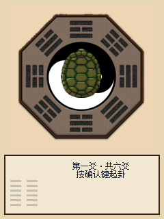
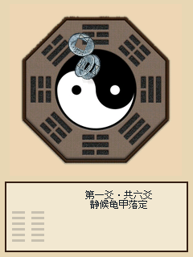
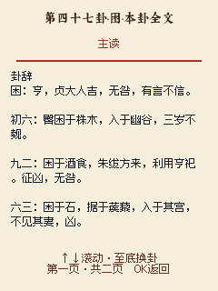

<p align="right">
  <strong>简体中文</strong> · <a href="README.md">默认入口</a>
</p>

# CyberYAO

CyberYAO 是为 FoloToy AI Passport 开发的离线六爻应用。三枚铜钱连续投掷六次，
从初爻向上生成本卦、动爻与之卦；完整收录六十四卦卦辞、三百八十四条爻辞，以及
乾卦用九和坤卦用六。

<p align="center">
  
  
  
</p>

## 特性

- 使用 ESP32-C3 射频噪声增强的 `esp_fill_random()`，完全离线运行。
- 每次投掷临时启用 Wi-Fi 射频，不扫描、不连接、不创建网络接口。
- 三钱法严格采用「字面计二、背面计三」，六次结果从初爻向上排列。
- 伪三维龟壳与铜钱动画，轨迹、落点、旋转角度均由硬件随机数驱动。
- 支持本卦、动爻、之卦、完整卦辞与六爻爻辞。
- 按朱熹《易学启蒙》的动爻数量规则标记主读内容。
- 每个卦使用一个可滚动阅读页，不再把每一爻拆成独立页面。
- 持续播放低声古朴环境音；起卦时自动切换为铜钱碰撞声。
- 固件与 macOS 模拟器共用同一套 C、LVGL、字体、图片和音频资源。

## 操作

| 按键 | 行为 |
| --- | --- |
| 确认短按 | 投掷下一爻；完成六爻后进入详细解读 |
| 上／下 | 在详细解读中滚动；到达边界后切换本卦与之卦 |
| 确认短按（解读页） | 返回结果总览 |
| 确认长按 | 清空当前结果并开始新卦 |

## 随机规则

每次投掷取得三个独立随机位，文字面计二，背面计三。

| 总数 | 爻 | 变化 |
| --- | --- | --- |
| 六 | 老阴 | 阴变阳 |
| 七 | 少阳 | 不变 |
| 八 | 少阴 | 不变 |
| 九 | 老阳 | 阳变阴 |

随机源失败时，本次投掷直接进入错误页，不使用伪随机或联网服务回退。

## 项目结构

```text
components/bsp/          AI Passport 板级驱动
components/yaogui_view/  六爻逻辑、LVGL 界面和生成资源
main/                    固件入口与硬件任务
simulator/               macOS LVGL + SDL2 模拟器
assets/                  可编辑图片与音频源文件
tests/                   主机逻辑与固件验证
tools/                   资源生成和统一验证脚本
docs/                    开发、硬件与发布文档
```

## 构建

固件使用 ESP-IDF `v5.5.3`：

```bash
idf.py set-target esp32c3
idf.py build
idf.py -p /dev/cu.usbmodem2101 flash monitor
```

macOS 模拟器需要 SDL2：

```bash
brew install sdl2 pkg-config
./simulator/build.sh
./simulator/run.sh
```

模拟器按键为方向键、`Enter`、`L`（长按确认）、`Esc`（复位）和 `Q`（退出）。

## 验证

```bash
./tools/validate.sh --static
./tools/validate.sh --firmware
./simulator/run.sh --smoke-test
```

主机测试覆盖三钱映射、六爻状态流转、六十四卦映射、朱熹主读规则、动画确定性和
完整阅读页。射频熵源与音频硬件仍需在 AI Passport 真机上验收。

## 上游与许可

项目基于 [FoloToy/ai-passport](https://github.com/folotoy/ai-passport) 开发，
保留原仓库的 BSP、构建链路和硬件文档。代码按仓库中的 [LICENSE](LICENSE) 发布。
